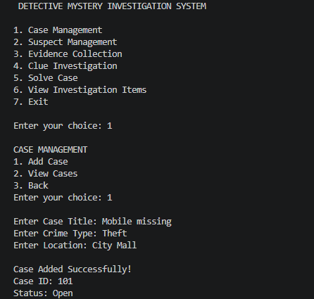
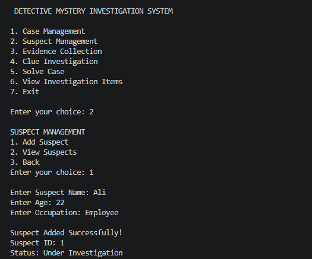
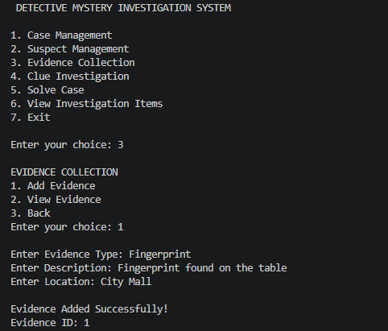
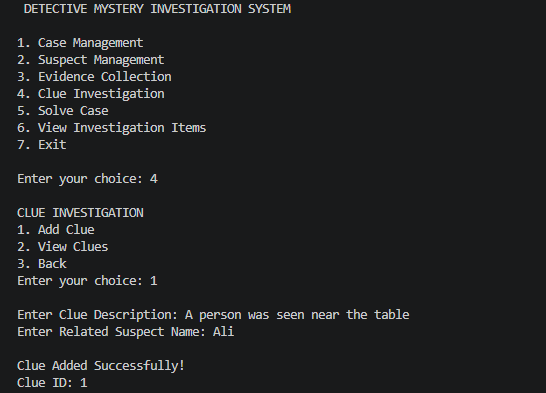
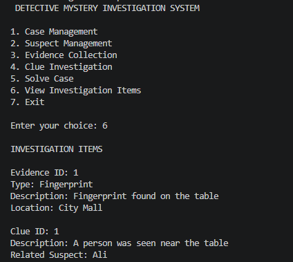
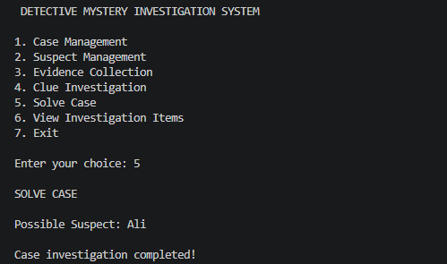
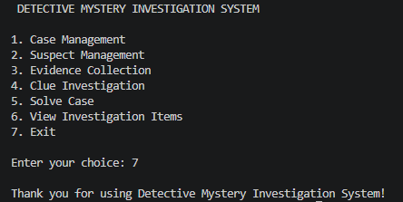

# Detective Mystery Investigation System

The Detective Mystery Investigation System is a C++ console-based project developed using Object-Oriented Programming (OOP) concepts.
The system is designed to manage and investigate mystery cases. It allows the user to create cases, manage suspects, collect evidence, record clues, and solve cases based on the available investigation information.

## 📸Screenshots

<table>
<tr>
<td align="center"><b>Case Management</b> </td>
<td align="center"><b>Suspect Management</b> </td>
</tr>
<tr>
<td align="center"><b>Evidence Collection</b> </td>
<td align="center"><b>Clue Investigation</b> </td>
</tr>
<tr>
<td align="center"><b>Investigation Items</b> </td>
<td align="center"><b>Solve Case</b> </td>
</tr>
<tr>
<td align="center"><b>Exit</b> </td>
</tr>

## ✨Main Features

* **Case Management** – Add and view mystery cases.
* **Suspect Management** – Add and view suspect information.
* **Evidence Collection** – Record and view evidence related to a case.
* **Clue Investigation** – Add clues and relate them to suspects.
* **Case Solving** – Analyze clues and suspects to identify a possible suspect.
* **Investigation Items** – Display evidence and clues using a common base class.
* **Exit** – Safely close the program.

## OOP Concepts Used

* Classes and Objects
* Encapsulation
* Constructors
* Inheritance
* Function Overriding
* Polymorphism

## Technologies Used

* C++
* Object-Oriented Programming

